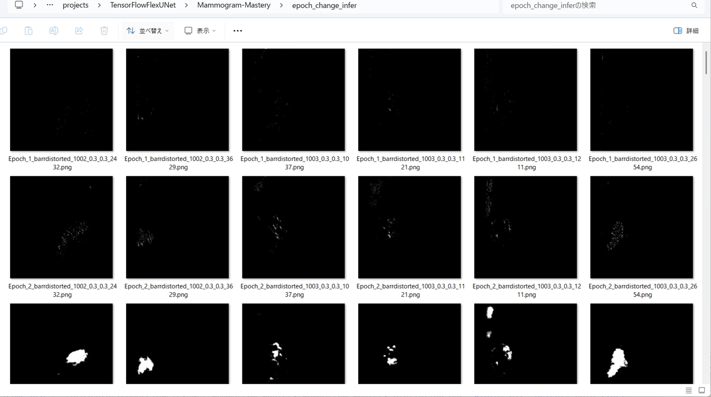
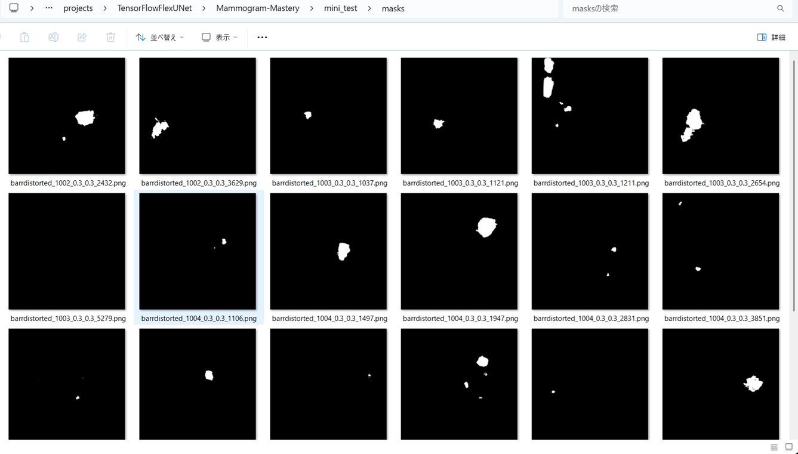

<h2>TensorFlow-FlexUNet-Image-Segmentation-Breast-Cancer-Mammogram-Mastery (2025/10/28)</h2>

This is the first experiment of Image Segmentation for Breast Cancer Mammogram-Mastery Singleclass,
 based on our 
TensorFlowFlexUNet (TensorFlow Flexible UNet Image Segmentation Model for Multiclass) 
and a 512x512 pixels 
<a href="https://drive.google.com/file/d/1zuwbxg-CMeqiZcTqyEjWy0BTNSBEJmFj/view?usp=sharing">
Augmented-Mammogram-Mastery-ImageMask-Dataset.zip</a>.
which was derived by us from   
<b>Breast Cancer Dataset/Original Dataset/Cancer/</b> in 
<a href="https://data.mendeley.com/datasets/fvjhtskg93/1">
<b>
Mammogram Mastery: A Robust Dataset for Breast Cancer Detection and Medical Education
</b>
</a>
 
 
As demonstrated in <a href="https://github.com/sarah-antillia/TensorFlow-FlexUNet-Image-Segmentation-STARE-Retinal-Vessel">
TensorFlow-FlexUNet-Image-Segmentation-STARE-Retinal-Vessel</a>, 
our Multiclass TensorFlowFlexUNet, which uses categorized masks, can also be applied to single-class image segmentation models. 
This is because it inherently treats the background as one category and your single-class mask data as a second category. 
In essence, your single-class segmentation model will operate with two categorized classes within our Multiclass UNet framework.
 
 

<b>Acutual Image Segmentation for 512x512 pixels Cancer images</b> 

As shown below, the inferred masks predicted by our segmentation model trained on the 
PNG dataset appear similar to the ground truth masks,
 
 
<table>
<tr>
<th>Input: image</th>
<th>Mask (ground_truth)</th>
<th>Prediction: inferred_mask</th>
</tr>
<tr>
<td></td>
<td></td>
<td></td>
</tr>
<tr>
<td></td>
<td></td>
<td></td>
</tr>
<tr>
<td></td>
<td></td>
<td></td>
</tr>
</table>

 
<h3>1. Dataset Citation</h3>
The dataset used was obtained from the web-site:  
<b>Breast Cancer Dataset/Original Dataset/Cancer</b> in 

<a href="https://data.mendeley.com/datasets/fvjhtskg93/1">
<b>
Mammogram Mastery: A Robust Dataset for Breast Cancer Detection and Medical Education
</b>
</a>
  
<b>Contributors</b> :
Karzan Barzan Aqdar,Peshraw Ahmed Abdalla,Rawand Kawa Mustafa,Zhiyar Hamid Abdulqadir,Abdalbasit Mohammed Qadir 
,Alla Abdulqader Shali,Nariman Muhamad Aziz
 
 
<b>Description</b> 
This dataset presents a comprehensive data comprising breast cancer images collected from patients, encompassing two distinct sets:
 one from individuals diagnosed with breast cancer and another from those without the condition.  
 The dataset is meticulously curated, vetted, and classified by specialist clinicians, ensuring its reliability and accuracy
  for research and educational purposes.  
  Hailing from Iraq-Sulaymaniyah, the dataset offers a unique perspective on breast cancer prevalence and characteristics 
  in the region.  
  With 745 original images and 9,685 augmented images, this dataset provides a rich resource for training and evaluating 
  deep learning algorithms aimed at breast cancer detection.  
  The dataset's inclusion of augmented X-rays offers enhanced versatility for algorithm development and educational initiatives. 
  This dataset holds immense potential for advancing medical research, aiding in the development of innovative diagnostic tools, 
  and fostering educational opportunities for medical students interested in breast cancer detection and diagnosis.  
<b>Licence:</b> 
<a href="https://creativecommons.org/licenses/by/4.0/">CC BY 4.0 </a>
 

<h3>
<a id="2">
2 Mammogram-Mastery ImageMask Dataset
</a>
</h3>
<h4>2.1 Download ImageMask Dataset</h4>
 If you would like to train this Mammogram-Mastery Segmentation model by yourself,
 please download the dataset from the google drive 
<a href="https://drive.google.com/file/d/1zuwbxg-CMeqiZcTqyEjWy0BTNSBEJmFj/view?usp=sharing">
Augmented-Mammogram-Mastery-ImageMask-Dataset.zip</a>.
 
, expand the downloaded ImageMaskDataset and put it under <b>./dataset</b> folder to be
<pre>
./dataset
└─Mammogram-Mastery
    ├─test
    │   ├─images
    │   └─masks
    ├─train
    │   ├─images
    │   └─masks
    └─valid
        ├─images
        └─masks
</pre>
 
<b>Mammogram-Mastery Statistics</b> 
 
 
As shown above, the number of images of train and valid datasets is large enough to use for a training set of our segmentation model.
 
 
<h4>2.2 ImageMask Dataset Derivation</h4>

<b>(1) Cropping Images </b> 
 
 We generated a 512x512 pixels cropped PNG dataset from 1920x1080 pixels JPG images in <b>Cancer</b> folder. 
<pre>
./Breast Cancer Dataset
└─Original Dataset 
    ├─Cancer
    └─Non-Cancer
</pre>

<b>(2) Generation annotation dataset</b> 
Since the masks (annotations) data were not provided for the original cancer images of the <b>Breast Cancer Dataset</b>, 
we generated our own PNG mask files correspong to the cropped PNG images by using 
a pretrained model <a href="https://github.com/sarah-antillia/TensorFlow-FlexUNet-Image-Segmentation-Breast-Cancer-INbreast">
TensorFlow-FlexUNet-Image-Segmentation-Breast-Cancer-INbreast</a> without a manual annotation by human experts</a>,
because the INbreast cancer images appeared similar to the images in <b>Cancer</b> subset of <b>Mammogram Mastery</b>.
   
<b>(3) Offline Dataset Augmentation</b> 
To address the limited size of the cropped PNG images and their corresponding masks, 
we applied our offline augmentation tools 
<a href="https://github.com/sarah-antillia/ImageMask-Dataset-Offline-Augmentation-Tool"> 
ImageMask-Dataset-Offline-Augmentation-Tool</a> and 
<a href="https://github.com/sarah-antillia/Barrel-Image-Distortion-Tool">Barrel-Image-Distortion-Tool</a>  
to the cropped dataset. 
 
 
<h4>2.3 Train Images and Masks Sample</h4>
<b>Train_images_sample</b> 

 
<b>Train_masks_sample</b> 

 
<h3>
3 Train TensorFlowFlexUNet Model
</h3>
 We trained Mammogram-Mastery TensorFlowFlexUNet Model by using the following
<a href="./projects/TensorFlowFlexUNet/Mammogram-Mastery/train_eval_infer.config"> <b>train_eval_infer.config</b></a> file.  
Please move to ./projects/TensorFlowFlexUNet/Mammogram-Mastery and run the following bat file. 
<pre>
>1.train.bat
</pre>
, which simply runs the following command. 
<pre>
>python ../../../src/TensorFlowFlexUNetTrainer.py ./train_eval_infer.config
</pre>

<b>Model parameters</b> 
Defined a small <b>base_filters = 16 </b> and large <b>base_kernels = (9,9)</b> for the first Conv Layer of Encoder Block of 
<a href="./src/TensorFlowFlexUNet.py">TensorFlowFlexUNet.py</a> 
and a large num_layers (including a bridge between Encoder and Decoder Blocks).
<pre>
[model]
;You may specify your own UNet class derived from our TensorFlowFlexModel
model         = "TensorFlowFlexUNet"
generator     =  False
image_width    = 512
image_height   = 512
image_channels = 3
num_classes    = 2

base_filters   = 16
base_kernels   = (9,9)
num_layers     = 8
dropout_rate   = 0.04
dilation       = (1,1)
</pre>
<b>Learning rate</b> 
Defined a very small learning rate.  
<pre>
[model]
learning_rate  = 0.00007
</pre>
<b>Loss and metrics functions</b> 
Specified "categorical_crossentropy" and <a href="./src/dice_coef_multiclass.py">"dice_coef_multiclass"</a>. 
<pre>
[model]
loss           = "categorical_crossentropy"
metrics        = ["dice_coef_multiclass"]
</pre>
<b>Dataset class</b> 
Specifed <a href="./src/ImageCategorizedMaskDataset.py">ImageCategorizedMaskDataset</a> class. 
<pre>
[dataset]
class_name    = "ImageCategorizedMaskDataset"
</pre>
 
<b>Learning rate reducer callback</b> 
Enabled learing_rate_reducer callback, and a small reducer_patience.
<pre> 
[train]
learning_rate_reducer = True
reducer_factor     = 0.4
reducer_patience   = 4
</pre>
<b>Early stopping callback</b> 
Enabled early stopping callback with patience parameter.
<pre>
[train]
patience      = 10
</pre>

<b>RGB Color map</b> 
rgb color map dict for Mammogram-Mastery 1+3 classes. 
<pre>
[mask]
mask_file_format = ".png"
; 1+1 classes
; RGB colors   cancer:white     
rgb_map = {(0,0,0):0,(255,255,255):1 }

</pre>

<b>Epoch change inference callback</b> 
Enabled <a href="./src/EpochChangeInfereuncer.py">epoch_change_infer callback</a></b>. 
<pre>
[train]
epoch_change_infer       = True
epoch_change_infer_dir   =  "./epoch_change_infer"
num_infer_images         = 6
</pre>

By using this callback, on every epoch_change, the inference procedure can be called
 for 6 images in <b>mini_test</b> folder. This will help you confirm how the predicted mask changes 
 at each epoch during your training process.    

<b>Epoch_change_inference output at starting (epoch 1,2,3)</b> 
 
 
<b>Epoch_change_inference output at middlepoint (epoch 17,18,19)</b> 
 
 
<b>Epoch_change_inference output at ending (epoch 35,36,37)</b> 
 
 
In this experiment, the training process was stopped at epoch 37 by EearlyStopping callback.  
 
 

<a href="./projects/TensorFlowFlexUNet/Mammogram-Mastery/eval/train_metrics.csv">train_metrics.csv</a> 
 

 
<a href="./projects/TensorFlowFlexUNet/Mammogram-Mastery/eval/train_losses.csv">train_losses.csv</a> 
 

 

<h3>
4 Evaluation
</h3>
Please move to <b>./projects/TensorFlowFlexUNet/Mammogram-Mastery</b> folder, 
and run the following bat file to evaluate TensorFlowFlexUNet model for Mammogram-Mastery. 
<pre>
./2.evaluate.bat
</pre>
This bat file simply runs the following command.
<pre>
python ../../../src/TensorFlowFlexUNetEvaluator.py ./train_eval_infer_aug.config
</pre>

Evaluation console output: 

  

<a href="./projects/TensorFlowFlexUNet/Mammogram-Mastery/evaluation.csv">evaluation.csv</a> 
The loss (categorical_crossentropy) to this Mammogram-Mastery/test was very low and dice_coef_multiclass 
very high as shown below.
 
<pre>
categorical_crossentropy,0.0054
dice_coef_multiclass,0.9976
</pre>
 

<h3>
5 Inference
</h3>
Please move <b>./projects/TensorFlowFlexUNet/Mammogram-Mastery</b> folder 
,and run the following bat file to infer segmentation regions for images by the Trained-TensorFlowFlexUNet model for Mammogram-Mastery. 
<pre>
./3.infer.bat
</pre>
This simply runs the following command.
<pre>
python ../../../src/TensorFlowFlexUNetInferencer.py ./train_eval_infer_aug.config
</pre>

<b>mini_test_images</b> 
 
<b>mini_test_mask(ground_truth)</b> 
 

<b>Inferred test masks</b> 
 
 

<b>Enlarged images and masks of 512x512 pixels Cancer images</b> 
<table>
<tr>
<th>Image</th>
<th>Mask (ground_truth)</th>
<th>Inferred-mask</th>
</tr>

<tr>
<td></td>
<td></td>
<td></td>
</tr>

<tr>
<td></td>
<td></td>
<td></td>
</tr>

<tr>
<td></td>
<td></td>
<td></td>
</tr>

<tr>
<td></td>
<td></td>
<td></td>
</tr>

<tr>
<td></td>
<td></td>
<td></td>
</tr>

<tr>
<td></td>
<td></td>
<td></td>
</tr>
</table>

 
<h3>
References
</h3>
<b>1. INbreast: toward a full-field digital mammographic database </b> 
Inês C Moreira, Igor Amaral, Inês Domingues, António Cardoso, Maria João Cardoso, Jaime S Cardoso 
<a href="https://pubmed.ncbi.nlm.nih.gov/22078258/">https://pubmed.ncbi.nlm.nih.gov/22078258/</a>
  
<b>2. Breast-Cancer-Segmentation-Datasets</b>
 
Curated collection of datasets for breast cancer segmentation
</a>
 
pablogiaccaglia 
<a href="https://github.com/pablogiaccaglia/Breast-Cancer-Segmentation-Datasets/blob/master/README.md">
Breast-Cancer-Segmentation-Datasets
</a>
 
 
<b>3. TensorFlow-FlexUNet-Image-Segmentation-Breast-Cancer-INbreast</b> 
Toshiyuki Arai antillia.com 
<a href="https://github.com/sarah-antillia/TensorFlow-FlexUNet-Image-Segmentation-Breast-Cancer-INbreast">
https://github.com/sarah-antillia/TensorFlow-FlexUNet-Image-Segmentation-Breast-Cancer-INbreast
</a>
 
 
<b>4. TensorFlow-FlexUNet-Image-Segmentation-MIAS-Mammogram</b> 
Toshiyuki Arai antillia.com 
<a href="https://github.com/sarah-antillia/TensorFlow-FlexUNet-Image-Segmentation-MIAS-Mammogram">
https://github.com/sarah-antillia/TensorFlow-FlexUNet-Image-Segmentation-MIAS-Mammogram
</a>

